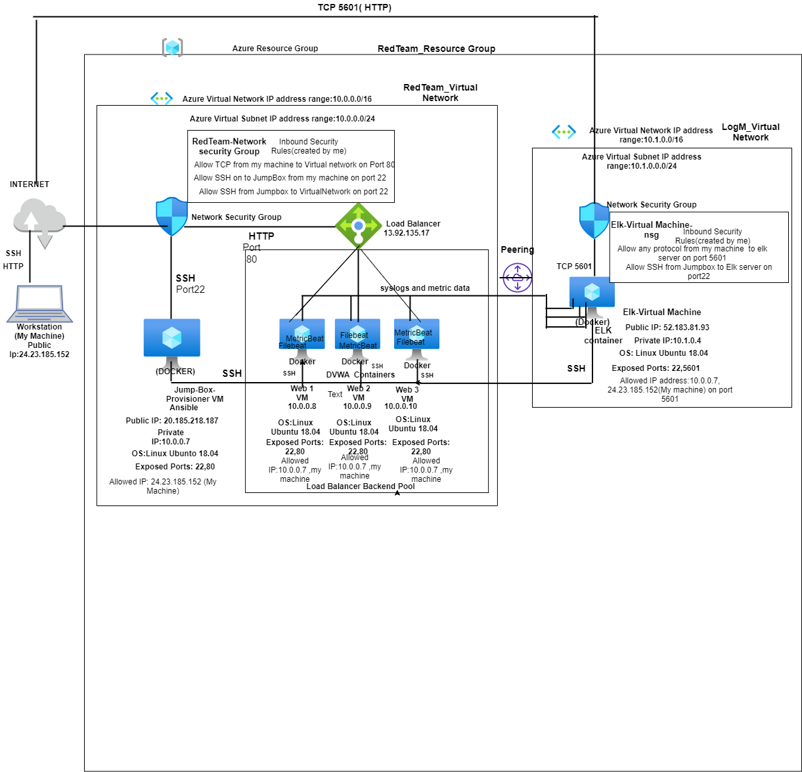

## Automated ELK Stack Deployment

The files in this repository were used to configure the network depicted below.

These files have been tested and used to generate a live ELK deployment on Azure. They can be used to either recreate the entire deployment pictured above. Alternatively, select portions of the filebeat-playbook.yml file may be used to install only certain pieces of it, such as Filebeat.

  [Filebeat Playbook File](Ansible/filebeat-playbook.yml)

This document contains the following details:
- Description of the Topology
- Access Policies
- ELK Configuration
  - Beats in Use
  - Machines Being Monitored
- How to Use the Ansible Build

### Description of the Topology

The main purpose of this network is to expose a load-balanced and monitored instance of DVWA, the D*mn Vulnerable Web Application.

Load balancing ensures that the application will be highly _available_, in addition to restricting _access_ to the network.
- _What aspect of security do load balancers protect?_
Load balancers protect the availability aspect of security and can also provide protection against host level DDOS attacks. For example, when one of the DVWA servers goes down, load balancers ensure that other DVWA servers provide services.
- _What is the advantage of a jump box?_
Jump box provides access from a single node to all the machines to be managed. It helps protect all the nodes from unnecessary connection attempts from Internet as well as enable monitoring from a single location. 
 

Integrating an ELK server allows users to easily monitor the vulnerable VMs for changes to the _application_ and system _configuration_.
- _ What does Filebeat watch for?_
Filebeat monitors the log files or locations that one specifies, collects log events, and forwards them either to Elasticsearch or Logstash for indexing.
- _ What does Metricbeat record?_
Metricbeat takes the metrics and statistics that it collects and ships them to the output that one specifies, such as Elasticsearch or Logstash.

The configuration details of each machine may be found below.

|     Name                    |     Function          |     IP Address                       |     Operating System      |
|-----------------------------|-----------------------|--------------------------------------|---------------------------|
|     Jump-Box-Provisioner    |     Gateway           |     10.0.0.7 /20.185.218.187         |     Linux ubuntu 18.04    |
|     Web-1                   |     Web Server        |     10.0.0.8                         |     Linux ubuntu 18.04    |
|     Web-2                   |     Web Server        |     10.0.0.9                         |     Linux ubuntu 18.04    |
|     Web-3                   |     Web Server        |     10.0.0.10                        |     Linux ubuntu 18.04    |
|     ELK-VirtualMachine      |     ELK Server        |     10.1.0.4 /52.183.81.93           |     Linux ubuntu 18.04    |
|     Red-Team-LB             |     Load Balancer     |     Static Public IP 13.192.95.17    |     Linux ubuntu 18.04    |
|     My_Machine              |     Workstation       |     Public IP 24.23.185.152          |     Linux ubuntu 18.04    |

### Access Policies

The machines on the internal network are not exposed to the public Internet. 

Only the _Jump-Box-Provisioner_ machine can accept connections from the Internet. Access to this machine is only allowed from the following IP addresses:

Workstation Public IP 24.23.185.52
  
Machines within the network can only be accessed by Jump-Box-Provisioner.
Which machine did you allow to access your ELK VM? What was its IP address?

Workstation Public IP 24.23.185.52 through TCP 5601

Jump-Box-Provisioner IP : 10.0.0.7 via SSH port 22

A summary of the access policies in place can be found in the table below.

|     Name                    |     Publicly Accessible    |     Allowed IP Addresses                                                                       |
|-----------------------------|----------------------------|------------------------------------------------------------------------------------------------|
|     Jump-Box-Provisioner    |     Yes                    |     Only from My Home IP 24.23.185.152 on port 22 using SSH                                    |
|     Web-1                   |     Yes                    |     Only from My Home IP 24.23.185.152 on port 80 using HTTP;SSH from 10.0.0.7(privately)      |
|     Web-2                   |     Yes                    |     Only from My Home IP 24.23.185.152 on port 80 using HTTP;SSH from 10.0.0.7(privately)      |
|     Web-3                   |     Yes                    |     Only from My Home IP 24.23.185.152 on port 80 using HTTP;SSH from 10.0.0.7(privately)      |
|     ELK-VirtualMachine      |     Yes                    |     Only from My Home IP 24.23.185.152 on port 5601 using HTTP;SSH from 10.0.0.7(privately)    |
|     Red-Team-LB             |     Yes                    |     Only from My Home IP 24.23.185.152 on port 5601 using HTTP                                 |

### Elk Configuration

Ansible was used to automate configuration of the ELK machine. No configuration was performed manually, which is advantageous because...
- _it allows for consistent, repeatable configuration that reduces the time of deployment and errors._

The playbook implements the following tasks:

- Install docker.io
- Install Python
- Install Docker Phython Module
- Increase Virtual Memory
- Download and launch a docker elk container 

The following screenshot displays the result of running `docker ps` after successfully configuring the ELK instance.

### Target Machines & Beats
This ELK server is configured to monitor the following machines:

|     Machine Name    |     Private IP Addresses    |
|---------------------|-----------------------------|
|     Web-1           |     10.0.0.8                |
|     Web-2           |     10.0.0.9                |
|     Web-3           |     10.0.0.10               |
 

We have installed the following Beats on these machines:
- _Filebeat and Metricbeat are specifically installed in these machines._

These Beats allow us to collect the following information from each machine:
- _Filebeat collect data (detects changes)from the file system. It can aid in locating new additions to recently added files or even inform you if those files have been previously modified. We are using this to monitor our Web log data._
- _ Metricbeat detects changes in the system metrics,such as CPU usage. Metricbeat creates an event and informs about the uptime/downtime._ 
 
### Using the Playbook
In order to use the playbook, you will need to have an Ansible control node already configured. Assuming you have such a control node provisioned: 

SSH into the control node and follow the steps below:
- Copy the install-elk.yml(playbook) file to /etc/ansible.
- Update the _hosts_ file to include which machine/machines the playbook will run on. eg: [ELK] 10.1.0.4 ansible_python_interpreter=/usr/bin/python3 and [webservers] to include the 3 Web  Vms
- Run the playbook, and navigate to _http://[my.ELK-VM.External.IP]:5601/app/kibana_ to check that the installation worked as expected.

### Notes: 
- We also need to download filebeat-config.yml and metricbeat-config.yml in /etc/ansible/files and create filebeat-playbook.yml and metricbeat-playbook.yml in /etc/ansible/roles file(We can download the template and modify it also). We need to modify the configuration files and the modified files are in repository under Ansible folders.The Ansible.config file needs to be updated with 'remote-user' variable assigned the name of user. After that, we need to run the playbooks using ansible-playbook command.These help to install Filebeat and Metricbeat in the Web VMs.After that, we can see that 'the data succesfully loaded' when we go to the kibana webpage in the 'Systemlog' and 'DockerMetric' options.  

### Additional Notes

The command to download the raw configuration file filebeat-config.yml into /etc/ansible/files is
curl https://gist.githubusercontent.com/slape/5cc350109583af6cbe577bbcc0710c93/raw/eca603b72586fbe148c11f9c87bf96a63cb25760/Filebeat >> /etc/ansible/files/filebeat-config.yml

The command to download the raw configuration file metricbeat-config.yml into /etc/ansible/files is
curl https://gist.githubusercontent.com/slape/58541585cc1886d2e26cd8be557ce04c/raw/0ce2c7e744c54513616966affb5e9d96f5e12f73/metricbeat >> /etc/ansible/files/metricbeat-config.yml

The command to update hosts file is

nano /etc/ansible/hosts   
and edit the file with nano editor and save with ctl X &'y'

#### Some Linux Commands

|      COMMAND                                             |      PURPOSE                                      |
|----------------------------------------------------------|---------------------------------------------------|
|     sudo apt-get update                                  |     this will update all packages                 |
|     sudo apt install docker.io                           |     install docker application                    |
|     sudo service docker start                            |     start the docker application                  |
|     systemctl status docker                              |     status of the docker application              |
|     sudo docker pull   cyberxsecurity/ansible            |     Pull the container file                       |
|     sudo docker run -ti   cyberxsecurity/ansible bash    |     run and create a docker image                 |
|     sudo docker start <image-name>                       |     starts the image specified                    |
|     sudo docker ps -a                                    |     list all active/inactive containers           |
|     sudo docker attach   <image-name>                    |     Activate shell on your container              |
|     ssh-keygen                                           |     create a ssh key                              |
|     ansible -m ping all                                  |     check the connection of ansible containers    |
